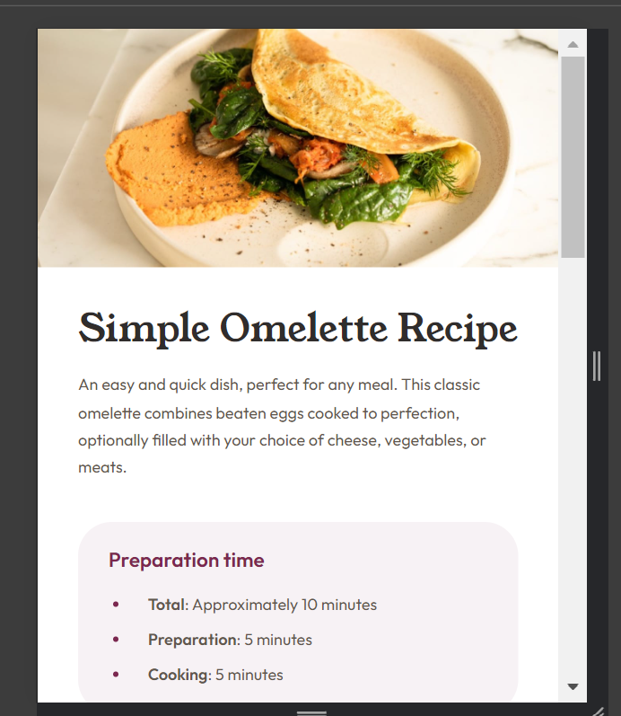
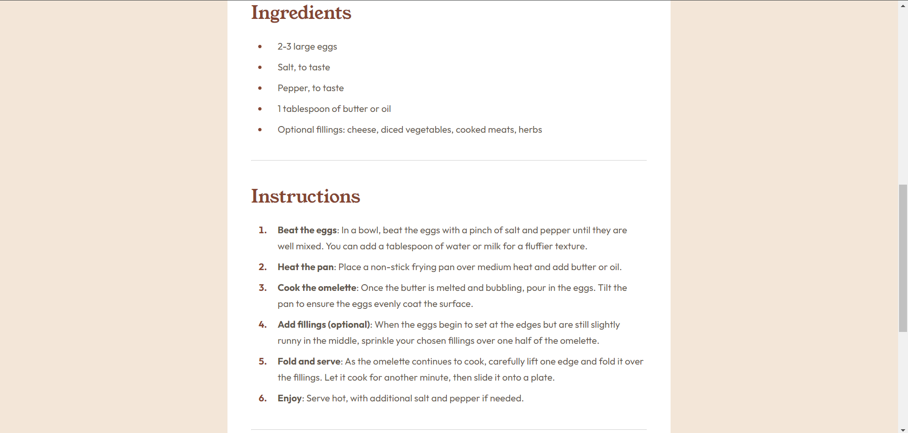
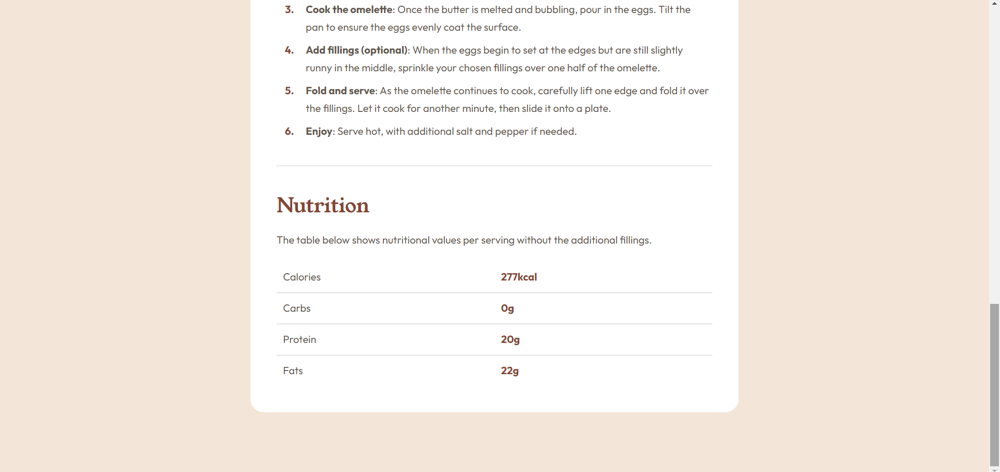

# Frontend Mentor - Recipe page solution

This is my solution to the [Recipe page challenge on Frontend Mentor](https://www.frontendmentor.io/challenges/recipe-page-KiTsR8QQKm). Frontend Mentor challenges help you improve your coding skills by building realistic projects. 

## Table of contents

- [Overview](#overview)
  - [The challenge](#the-challenge)
  - [Screenshot](#screenshot)
  - [Links](#links)
- [My process](#my-process)
  - [Built with](#built-with)
  - [What I learned](#what-i-learned)

## Overview
Eventhough this is a very small project. This project has helped me practice css concepts.

### Screenshot






### Links

- Solution URL: [Add solution URL here](https://github.com/huz3y/recipe-page-main.git)

## My process

### Built with

- Semantic HTML5 markup
- CSS custom properties
- SCSS (css preprocessor)

### What I learned

I learnt a new pseudo element while doing this project. Which is the :marker element that allows us to style list marker.

```scss
li  {
      padding: .4rem;
      margin-left: 3rem;
      padding-left: 1.5rem;

       &::marker   {
          color: var(--color-primary-1);
          margin-right: 1rem;
          font-weight: 700;
      }
}
```